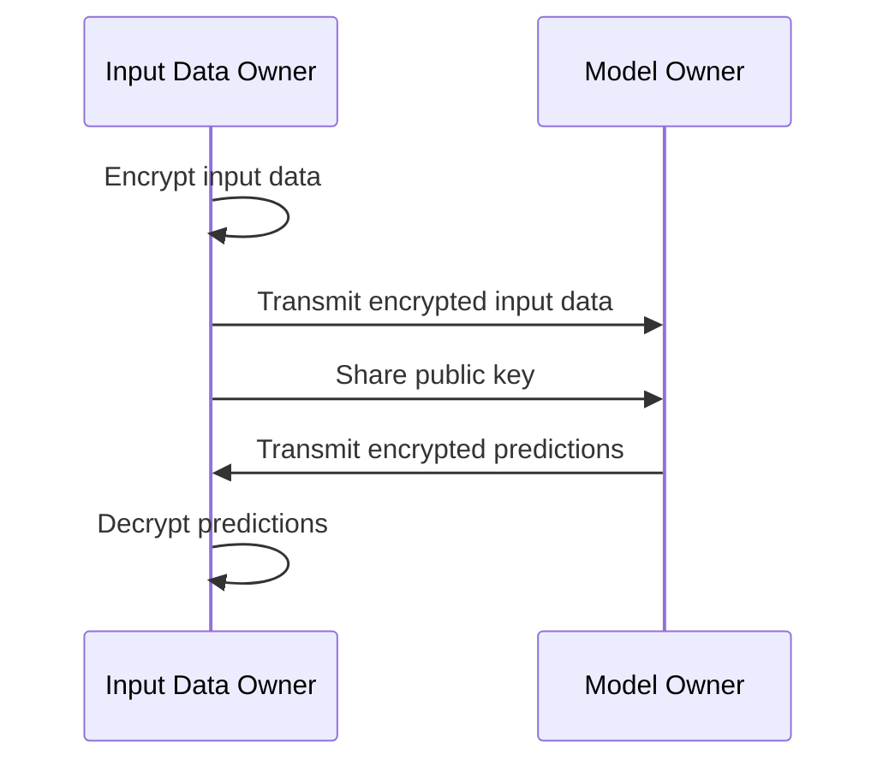
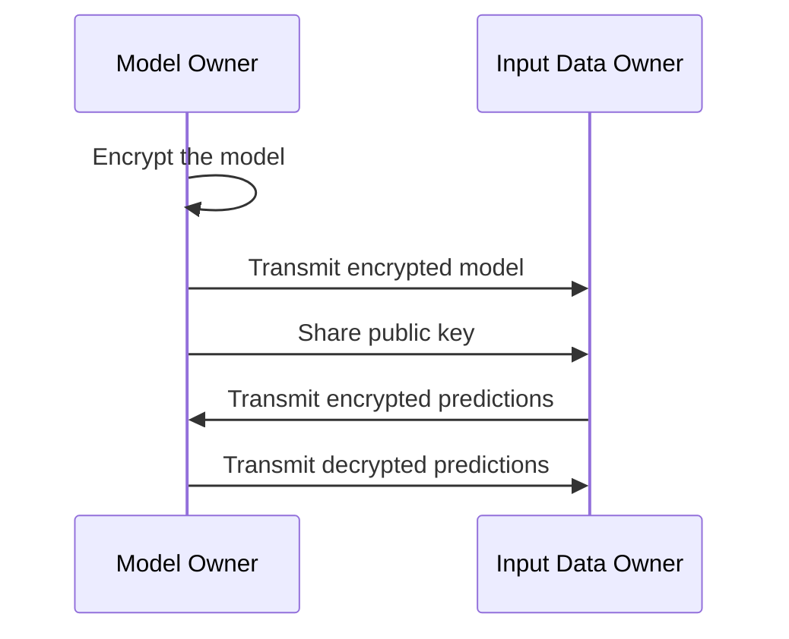
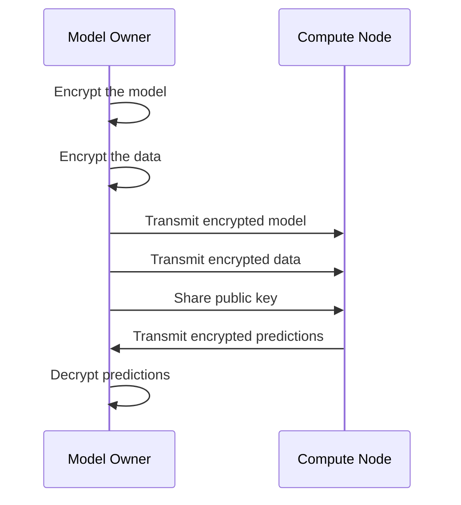

# SecML encryption Plugin
The SecML Encryption Plugin introduces Homomorphic Encryption capabilities to SecML2 (https://github.com/pralab/secml2), enabling privacy-preserving machine learning operations. This plugin facilitates the encapsulation of a PyTorch neural network within an object that supports Homomorphic Encryption, allowing secure computation on encrypted data.

The plugin can be utilized in the following three scenarios:
1. Encryption of input data
2. Encryption model weights
3. Encryption input data and model weights

## Encrypted input data
In this scenario there are two subject:
1. Input data owner
2. Model owner

The model is executed on the **model owner**'s machine. To enable its usage, the **input data owner** encrypts the data prior to transmission to the **model owner**. This plugin provides the necessary functionality for the **model owner** to encapsulate the model such that it can operate on encrypted data.

The supported layer types in this scenario are
1. Pytorch Linear
2. Pytorch Conv2d

The only activation function currently supported is the SqNL activation function provided within this module.

## Encryption of Model Weights
This scenario involves two entities:
1. Input data owner
2. Model owner

In this context, the **model owner** is responsible for training the model and encrypting it using this plugin. The encrypted model can then be distributed to the **input data owner** without revealing the model weights. The **input data owner** may utilize the encrypted model to generate encrypted predictions, which must subsequently be decrypted by the **model owner** using their private key.

In this scenario, only the PyTorch Linear layer type is supported.

The only activation function available is the SqNL activation function provided within this module.

## Encrypted input data and weights
This scenario involves two entities:
1. Model owner
2. Compute node

The **model owner** trains the model and encrypts both the model and the input data. The encrypted model and data are then transferred to the **compute node** without exposing the model weights or data. The compute node utilizes the encrypted model to generate encrypted predictions, which are then sent back to the model owner for decryption.

In this scenario, the only supported layer type is PyTorch Linear.

The only activation function supported is the SqNL activation function provided within this module.

## Contributing

We welcome contributions from the research community to expand the library's capabilities or add new features. 
If you would like to contribute to SecML-Fair, please follow our [contribution guidelines](https://github.com/simoneminisi/secml-fair/blob/main/CONTRIBUTING.md).

## Acknowledgements
SecML-encryption has been partially developed with the support of European Union’s [ELSA – European Lighthouse on Secure and Safe AI](https://elsa-ai.eu) under the grant agreement No. 101070617.

 &nbsp;&nbsp; 
